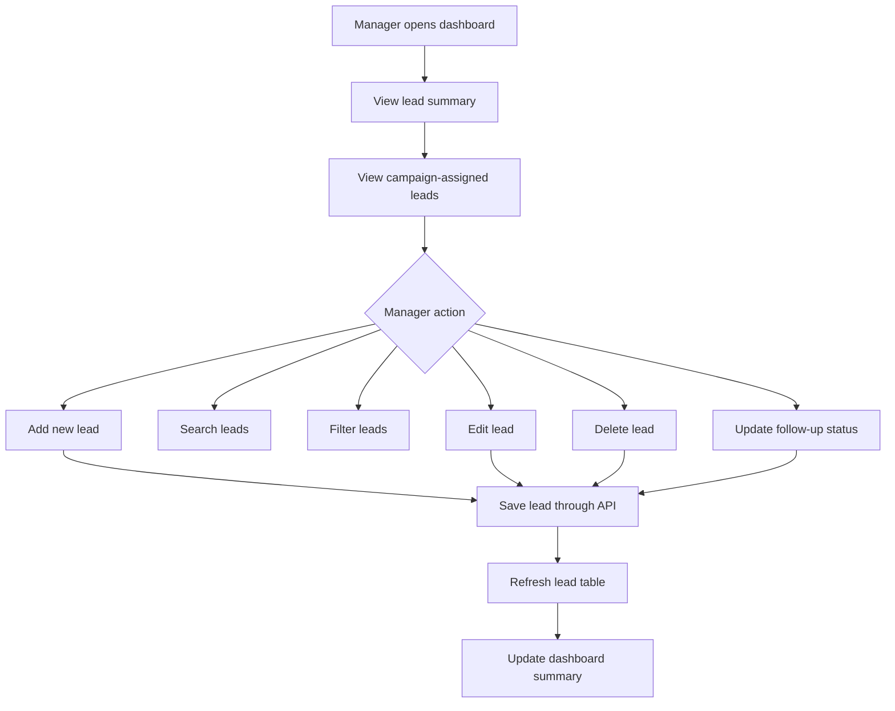
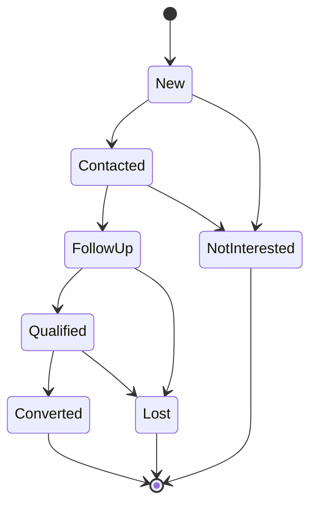
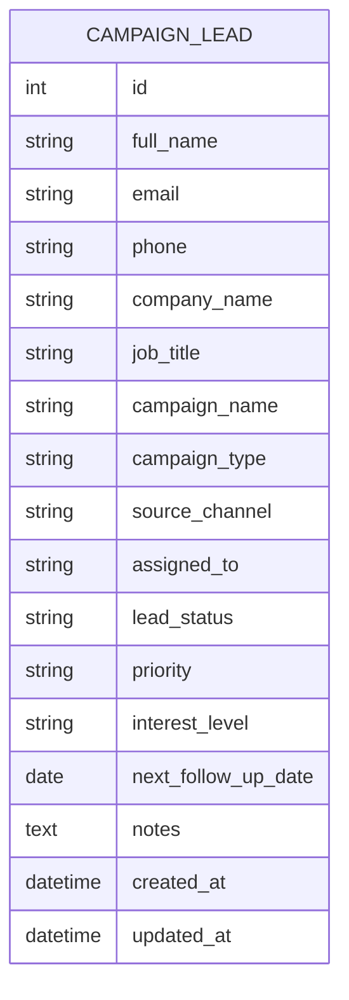
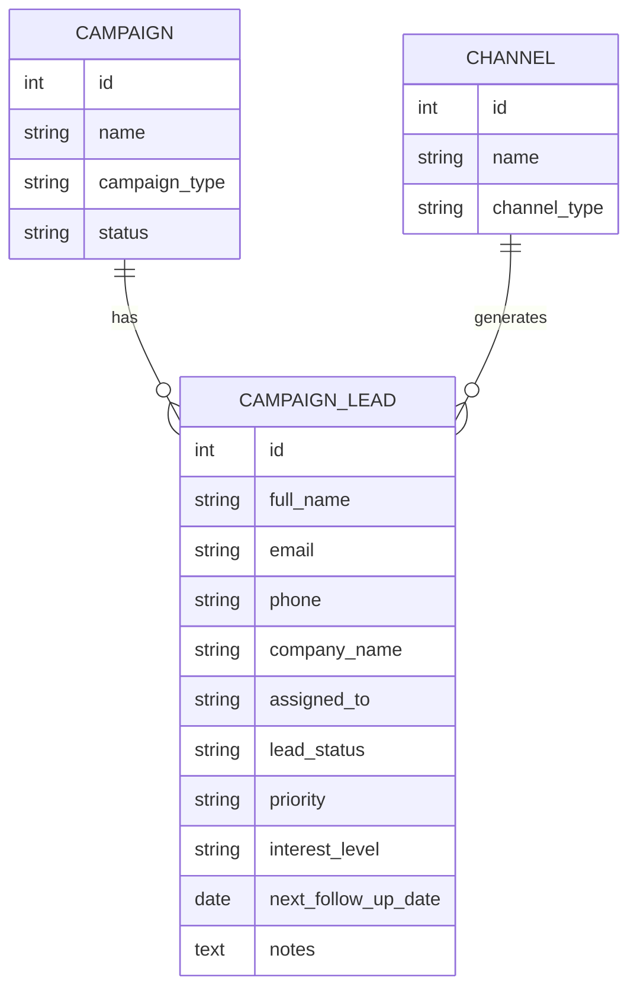
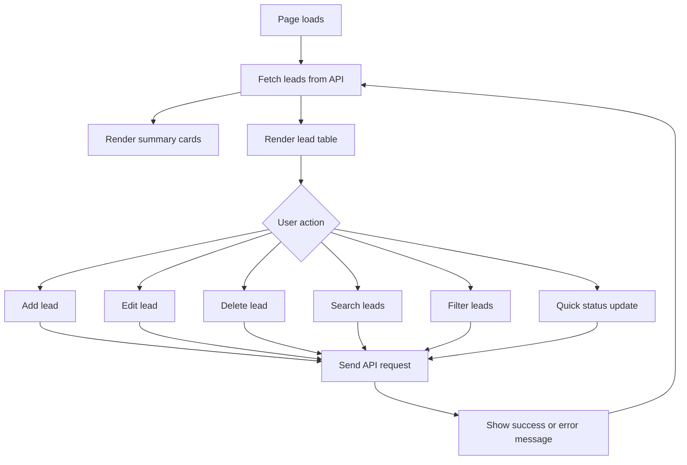
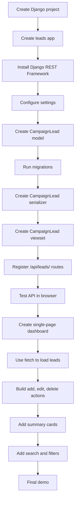

# Campaign Lead Management System

## Purpose

This system is a focused internal dashboard for managing marketing leads that are assigned to campaigns.

The goal is not to manage marketing team leads, campaign managers, clients, or full campaign operations. The goal is to manage the actual leads generated by or assigned to marketing campaigns.

The application should help a manager answer:

- Which leads are assigned to each campaign?
- Which channel did each lead come from?
- What is the current status of each lead?
- Who is responsible for following up with each lead?
- Which leads need attention today?
- Which leads are converted, lost, new, or in follow-up?

## Required Technology

- Backend: Django
- API: Django REST Framework
- Database: SQLite
- Frontend: Single-page HTML, CSS, and JavaScript
- API communication: JavaScript `fetch()`

## Core Business Focus

Only one business object is actively managed:

```text
Campaign Lead
```

Campaigns and channels are used to classify and filter those leads. They can be simple fields in the lead record for the MVP.

## Main User

### Manager

The manager uses the dashboard to:

- Add campaign-assigned leads
- View all leads
- Search leads
- Filter leads by campaign, channel, status, or priority
- Update lead information
- Update lead follow-up status
- Delete incorrect or duplicate leads
- See summary counts of lead performance

## MVP Data Model

For the practical test, use one main model: `CampaignLead`.

This keeps the system focused and fast to implement.

### CampaignLead

Suggested fields:

```text
id
full_name
email
phone
company_name
job_title
campaign_name
campaign_type
source_channel
assigned_to
lead_status
priority
interest_level
notes
next_follow_up_date
created_at
updated_at
```

## Field Details

### Lead Identity

```text
full_name
email
phone
company_name
job_title
```

These fields describe the person or business contact.

Example:

```text
Full Name: Tanvir Hasan
Email: tanvir@example.com
Phone: 01700000000
Company: ABC Fashion
Job Title: Marketing Manager
```

### Campaign Assignment

```text
campaign_name
campaign_type
source_channel
```

These fields explain where the lead belongs and how the lead was generated.

Suggested campaign types:

```text
seo
social_media
paid_ads
email
event
content
referral
```

Suggested source channels:

```text
facebook
instagram
google_ads
linkedin
email
website
youtube
event_booth
referral
```

Example:

```text
Campaign Name: Eid Offer Campaign
Campaign Type: Paid Ads
Source Channel: Facebook
```

### Lead Ownership

```text
assigned_to
```

This field stores the person responsible for following up with the lead.

For the MVP, this can be a simple text field.

Example:

```text
Assigned To: Rahim Ahmed
```

Later, this could become a foreign key to a `User` or `Staff` model.

### Lead Tracking

```text
lead_status
priority
interest_level
next_follow_up_date
notes
```

Suggested lead statuses:

```text
new
contacted
follow_up
qualified
converted
lost
not_interested
```

Suggested priorities:

```text
low
medium
high
urgent
```

Suggested interest levels:

```text
cold
warm
hot
```

Example:

```text
Lead Status: Follow Up
Priority: High
Interest Level: Hot
Next Follow-up Date: 2026-06-20
Notes: Interested in pricing and wants a call this week.
```

## Full System Flow



## Lead Lifecycle Flow



## Entity Relationship Diagram

For the MVP, use a single table.



## Optional Extended Model

If the system needs to grow later, campaigns and channels can be separated into their own tables.



Recommended for the test:

```text
Use the MVP single-table version first.
```

## REST API Design

Use Django REST Framework `ModelViewSet` for `CampaignLead`.

```text
GET    /api/leads/
POST   /api/leads/
GET    /api/leads/{id}/
PUT    /api/leads/{id}/
PATCH  /api/leads/{id}/
DELETE /api/leads/{id}/
```

## Example API Payload

```json
{
  "full_name": "Tanvir Hasan",
  "email": "tanvir@example.com",
  "phone": "01700000000",
  "company_name": "ABC Fashion",
  "job_title": "Marketing Manager",
  "campaign_name": "Eid Offer Campaign",
  "campaign_type": "paid_ads",
  "source_channel": "facebook",
  "assigned_to": "Rahim Ahmed",
  "lead_status": "follow_up",
  "priority": "high",
  "interest_level": "hot",
  "next_follow_up_date": "2026-06-20",
  "notes": "Interested in pricing and wants a call this week."
}
```

## Search and Filter Requirements

Recommended query parameters:

```text
/api/leads/?search=tanvir
/api/leads/?campaign_name=Eid Offer Campaign
/api/leads/?campaign_type=paid_ads
/api/leads/?source_channel=facebook
/api/leads/?assigned_to=Rahim Ahmed
/api/leads/?lead_status=follow_up
/api/leads/?priority=high
/api/leads/?interest_level=hot
```

## Dashboard UI Design

The frontend should be a single-page lead dashboard.

### Summary Cards

Show:

```text
Total Leads
New Leads
Contacted Leads
Follow-up Leads
Qualified Leads
Converted Leads
Lost Leads
High Priority Leads
Leads Due for Follow-up
```

### Lead Form

The form should support both add and edit mode.

Fields:

```text
Full Name
Email
Phone
Company Name
Job Title
Campaign Name
Campaign Type
Source Channel
Assigned To
Lead Status
Priority
Interest Level
Next Follow-up Date
Notes
```

### Lead Table

The table should show:

```text
Name
Contact
Company
Campaign
Channel
Assigned To
Status
Priority
Interest
Next Follow-up
Actions
```

Actions:

```text
Edit
Delete
Mark Contacted
Mark Converted
Mark Lost
```

## Frontend Interaction Flow



## Suggested Django App Structure

```text
campaign_lead_system/
    manage.py
    campaign_lead_system/
        settings.py
        urls.py
    leads/
        models.py
        serializers.py
        views.py
        urls.py
        admin.py
        migrations/
    templates/
        index.html
    static/
        css/
            styles.css
        js/
            app.js
```

For a fast practical test, `index.html` may contain the CSS and JavaScript inline.

## Validation Rules

Recommended validation:

- `full_name` is required
- `phone` or `email` should be required
- `campaign_name` is required
- `source_channel` is required
- `lead_status` must use fixed choices
- `priority` must use fixed choices
- `interest_level` must use fixed choices
- `next_follow_up_date` should be optional
- duplicate leads can be checked by email or phone

## Implementation Order



## Practical Test MVP Checklist

The system is complete when a manager can:

1. Add a lead assigned to a campaign.
2. View all campaign-assigned leads.
3. Search or filter leads.
4. Update lead details.
5. Update lead status.
6. Delete a lead.
7. See dashboard summary counts.
8. View the JSON API response from `/api/leads/`.

## Demo Script

At the end of the build, demonstrate:

1. Create a lead for a campaign.
2. Show the lead in the dashboard table.
3. Filter leads by campaign or status.
4. Edit the lead status from `new` to `contacted`.
5. Update the lead to `converted` or `lost`.
6. Delete a test lead.
7. Open `/api/leads/` and show the JSON response.

Suggested explanation:

```text
This system focuses only on managing leads assigned to marketing campaigns. Each lead stores contact details, campaign assignment, source channel, assigned follow-up owner, status, priority, interest level, and next follow-up date. Campaigns and channels are tracked as fields so managers can filter and understand where each lead came from without building a larger campaign management system.
```


Submission requirements:
Complete all required features from the project brief
Add at least one improvement or enhancement of your own
Push the code to a public GitHub repository
Deploy the application to a live hosting platform of your choice
Share the public GitHub repository link
Share the live application URL
Share the AI conversation/export (Claude Code, Codex, Cursor, etc.) used during development
Include a README with setup instructions
 
 