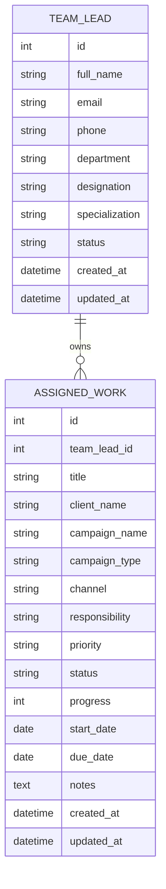
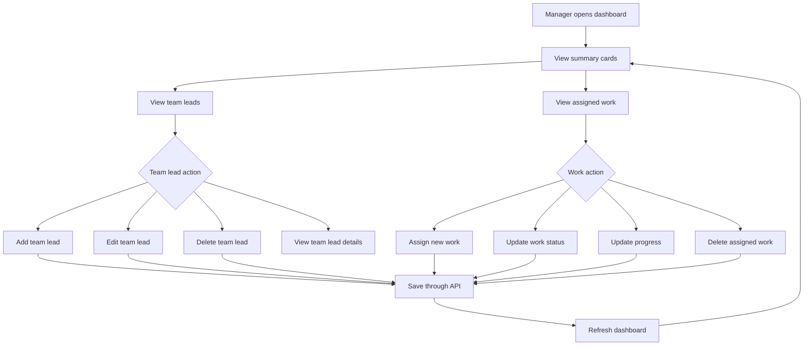
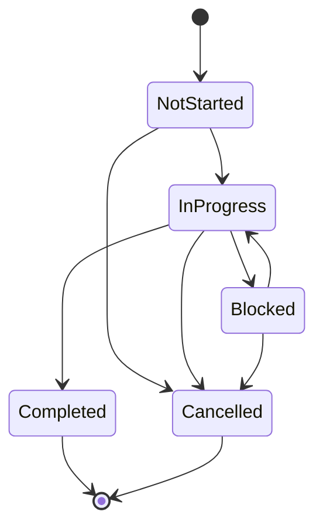
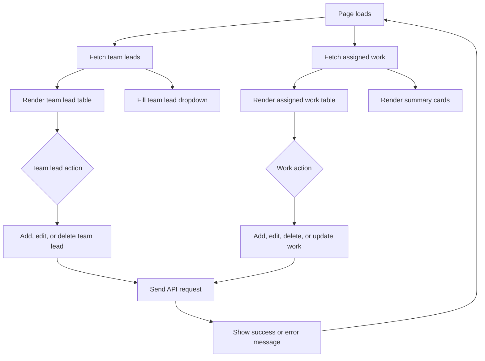
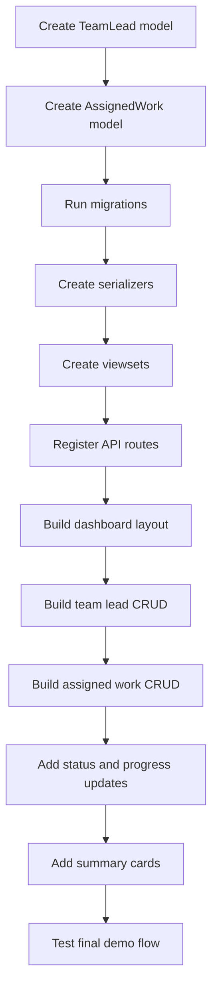

# Marketing Team Lead Management System

## Purpose

This system helps a manager track marketing team leads and the campaign work assigned to them.

The focus is not full CRM, sales lead tracking, authentication, payroll, or complex campaign planning. The focus is simple team lead management:

- Add marketing team leads
- View all team leads in one dashboard
- Update team lead information
- Delete team leads
- Assign campaign/client/channel responsibilities
- Track status and progress of assigned work

## Main Users

### Manager

The manager can:

1. Add a new marketing team lead
2. View all marketing team leads
3. View useful details about each team lead
4. Update a team lead
5. Delete a team lead
6. Assign marketing work or campaign responsibility
7. Track status and progress of assigned work

## Manager Login

The dashboard is protected by Django session login.

For the practical demo, use:

```text
Username: manager
Password: manager123
```

These credentials are shown on the login page for easy testing.

### Marketing Team Lead

A marketing team lead is the person responsible for one or more marketing assignments.

Examples:

```text
Rahim Ahmed manages paid ad campaigns.
Sara Khan manages social media campaigns.
Mina Akter manages SEO and content campaigns.
```

## Recommended MVP Scope

Use two main models:

```text
TeamLead
AssignedWork
```

This is enough for the practical test and keeps the app simple.

## Data Model

### TeamLead

Stores information about the marketing team lead.

Recommended fields:

```text
id
full_name
email
phone
department
designation
specialization
status
created_at
updated_at
```

Recommended `status` choices:

```text
active
inactive
on_leave
```

Example:

```text
Full Name: Rahim Ahmed
Email: rahim@example.com
Department: Digital Marketing
Designation: Marketing Team Lead
Specialization: Paid Ads
Status: Active
```

### AssignedWork

Stores campaign/client/channel responsibility assigned to a team lead.

Recommended fields:

```text
id
team_lead
title
client_name
campaign_name
campaign_type
channel
responsibility
priority
status
progress
start_date
due_date
notes
created_at
updated_at
```

Recommended `campaign_type` choices:

```text
seo
social_media
paid_ads
email
content
event
brand_awareness
lead_generation
```

Recommended `channel` choices:

```text
facebook
instagram
google_ads
linkedin
email
website
youtube
offline_event
```

Recommended `status` choices:

```text
not_started
in_progress
blocked
completed
cancelled
```

Recommended `priority` choices:

```text
low
medium
high
urgent
```

Progress:

```text
0 to 100
```

Example:

```text
Title: Eid Offer Paid Ads Management
Team Lead: Rahim Ahmed
Client: ABC Fashion
Campaign: Eid Offer Campaign
Channel: Facebook
Status: In Progress
Progress: 65
Priority: High
```

## Relationship

```text
One TeamLead can have many AssignedWork records.
Each AssignedWork record belongs to one TeamLead.
```

## Entity Relationship Diagram



## System Flow Diagram



## Assigned Work Lifecycle



## API Design

Use Django REST Framework `ModelViewSet`.

### Team Leads

```text
GET    /api/team-leads/
POST   /api/team-leads/
GET    /api/team-leads/{id}/
PUT    /api/team-leads/{id}/
PATCH  /api/team-leads/{id}/
DELETE /api/team-leads/{id}/
```

### Assigned Work

```text
GET    /api/assigned-work/
POST   /api/assigned-work/
GET    /api/assigned-work/{id}/
PUT    /api/assigned-work/{id}/
PATCH  /api/assigned-work/{id}/
DELETE /api/assigned-work/{id}/
```

## Example TeamLead JSON

```json
{
  "full_name": "Rahim Ahmed",
  "email": "rahim@example.com",
  "phone": "01700000000",
  "department": "Digital Marketing",
  "designation": "Marketing Team Lead",
  "specialization": "Paid Ads",
  "status": "active"
}
```

## Example AssignedWork JSON

```json
{
  "team_lead": 1,
  "title": "Eid Offer Paid Ads Management",
  "client_name": "ABC Fashion",
  "campaign_name": "Eid Offer Campaign",
  "campaign_type": "paid_ads",
  "channel": "facebook",
  "responsibility": "Manage ad copy, targeting, budget monitoring, and weekly reporting.",
  "priority": "high",
  "status": "in_progress",
  "progress": 65,
  "start_date": "2026-06-15",
  "due_date": "2026-06-30",
  "notes": "Campaign is performing well. Needs budget review."
}
```

## Search and Filters

Recommended filters:

```text
/api/team-leads/?search=rahim
/api/team-leads/?status=active
/api/team-leads/?department=Digital Marketing

/api/assigned-work/?team_lead=1
/api/assigned-work/?status=in_progress
/api/assigned-work/?priority=high
/api/assigned-work/?campaign_type=paid_ads
/api/assigned-work/?channel=facebook
```

## Dashboard Design

Single-page dashboard sections:

```text
1. Summary cards
2. Team lead form
3. Team lead table
4. Assigned work form
5. Assigned work table
```

### Summary Cards

```text
Total Team Leads
Active Team Leads
Total Assigned Work
In Progress Work
Blocked Work
Completed Work
Average Progress
High Priority Work
```

### Team Lead Table

Columns:

```text
Name
Contact
Department
Designation
Specialization
Status
Assigned Work Count
Actions
```

Actions:

```text
Edit
Delete
View Work
```

### Assigned Work Table

Columns:

```text
Title
Team Lead
Client
Campaign
Channel
Priority
Status
Progress
Due Date
Actions
```

Actions:

```text
Edit
Delete
Mark In Progress
Mark Completed
Mark Blocked
```

## Frontend Flow



## Validation Rules

Recommended validation:

- Team lead `full_name` is required
- Team lead `email` should be unique
- Assigned work must have a `team_lead`
- Assigned work `title` is required
- Assigned work `campaign_name` is required
- Assigned work `progress` must be between 0 and 100
- Assigned work `due_date` should not be earlier than `start_date`
- Status, priority, campaign type, and channel should use fixed choices

## Implementation Order



## Practical Test Checklist

The app satisfies the requirement when a manager can:

1. Add a new marketing team lead.
2. View all marketing team leads in a single-page dashboard.
3. View useful details about each team lead.
4. Update a team lead's information.
5. Delete a team lead.
6. Track campaign responsibility assigned to each team lead.
7. Track current progress or status of assigned work.

## Demo Script

Show this flow:

1. Add a team lead.
2. Assign campaign work to that team lead.
3. View the team lead in the dashboard.
4. View the assigned work in the dashboard.
5. Update the team lead details.
6. Update assigned work status and progress.
7. Delete a test record.
8. Open `/api/team-leads/` and `/api/assigned-work/` to show JSON responses.

## Short Explanation

```text
The system is designed around marketing team leads and their assigned work. TeamLead stores the person responsible for marketing work. AssignedWork stores the campaign, client, channel, responsibility, status, and progress assigned to that person. This keeps the system small while still meeting the requirement to manage team leads and track their campaign responsibilities.
```
