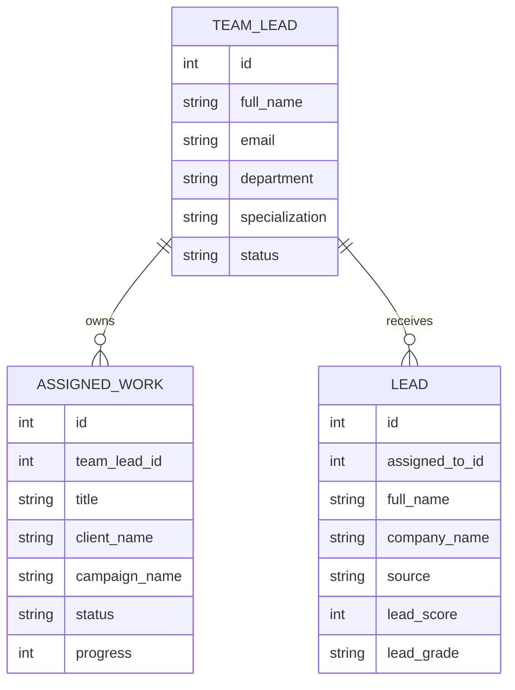
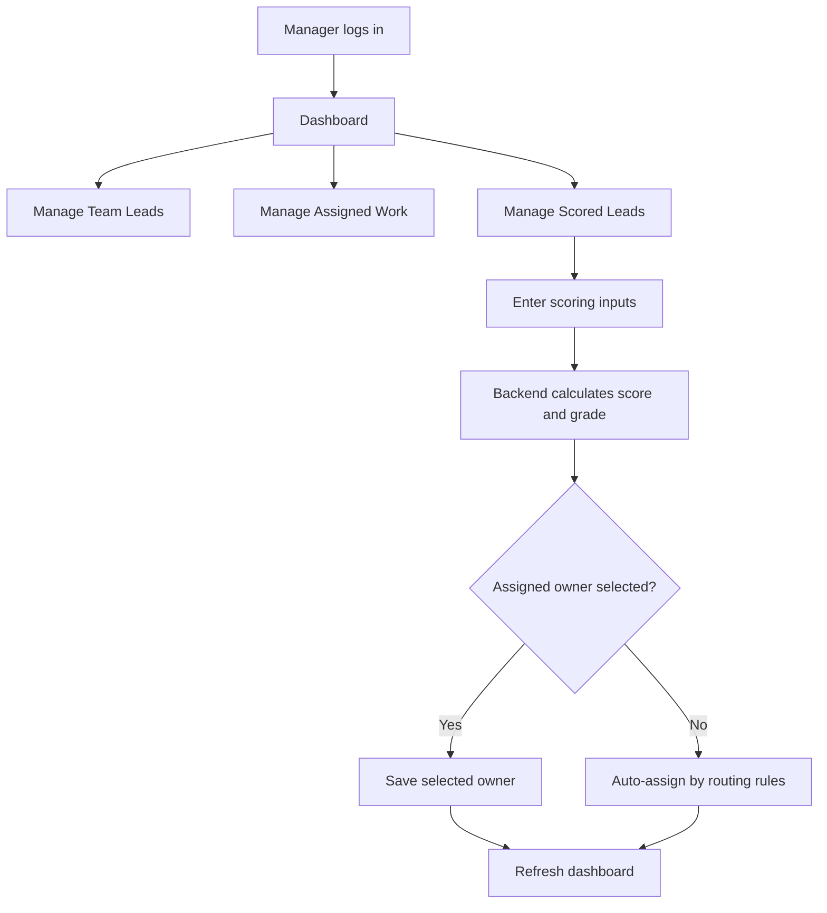

# Marketing Team Lead Management System

## Purpose

This system helps a manager track marketing team leads, the campaign work assigned to them, and scored leads that need to be routed to the right owner.

The system is intentionally focused:

- Manage marketing team leads
- Assign campaign/client/channel work
- Track work status and progress
- Score incoming leads
- Auto-distribute leads to suitable team leads
- Show operational metrics and charts

## Manager Login

The dashboard is protected by Django session login.

```text
Username: manager
Password: manager123
```

These credentials are shown on the login page for the practical demo.

## Core Models

```text
TeamLead
AssignedWork
Lead
```

## TeamLead

Stores the marketing team lead responsible for assigned work and routed leads.

Fields:

```text
id
full_name
email
phone
department
designation
specialization
status
created_at
updated_at
```

Status choices:

```text
active
inactive
on_leave
```

Example:

```text
Rahim Ahmed
Digital Marketing
Marketing Team Lead
Paid Ads
active
```

## AssignedWork

Stores campaign/client/channel responsibility assigned to a team lead.

Fields:

```text
id
team_lead
title
client_name
campaign_name
campaign_type
channel
responsibility
priority
status
progress
start_date
due_date
notes
created_at
updated_at
```

Campaign type choices:

```text
seo
social_media
paid_ads
email
content
event
brand_awareness
lead_generation
```

Channel choices:

```text
facebook
instagram
google_ads
linkedin
email
website
youtube
offline_event
```

Status choices:

```text
not_started
in_progress
blocked
completed
cancelled
```

Priority choices:

```text
low
medium
high
urgent
```

## Lead

Stores a scored lead/prospect. The backend calculates score and grade automatically.

Fields:

```text
id
full_name
email
phone
company_name
industry
annual_revenue
source
assigned_to
status
email_engagement
social_engagement
website_visits
form_submissions
lead_score
lead_grade
notes
created_at
updated_at
```

Source choices:

```text
form
website
chat
social_media
email_campaign
event
referral
paid_ads
```

Lead status choices:

```text
new
contacted
qualified
converted
lost
```

Lead grade choices:

```text
hot
warm
cold
```

## Lead Scoring

Score inputs:

```text
email_engagement
social_engagement
website_visits
form_submissions
annual_revenue
industry
```

Scoring logic:

```text
email engagement: up to 25 points
social engagement: up to 20 points
website visits: up to 15 points
form submissions: up to 15 points
annual revenue: up to 15 points
industry fit: up to 10 points
```

Grade rules:

```text
75-100 -> hot
45-74  -> warm
0-44   -> cold
```

## Lead Distribution

If `assigned_to` is blank, the lead is auto-assigned by the backend.

Rules:

```text
Hot leads -> active team lead with matching specialization
Paid Ads leads -> Paid Ads specialist
Social Media leads -> Social Media specialist
Website leads -> SEO specialist
Email Campaign leads -> Email specialist
No match -> active team lead with the lowest scored-lead count
```

This helps prevent unattended leads.

## Relationship Diagram



## System Flow



## API Endpoints

### Team Leads

```text
GET    /api/team-leads/
POST   /api/team-leads/
GET    /api/team-leads/{id}/
PUT    /api/team-leads/{id}/
PATCH  /api/team-leads/{id}/
DELETE /api/team-leads/{id}/
```

### Assigned Work

```text
GET    /api/assigned-work/
POST   /api/assigned-work/
GET    /api/assigned-work/{id}/
PUT    /api/assigned-work/{id}/
PATCH  /api/assigned-work/{id}/
DELETE /api/assigned-work/{id}/
```

### Scored Leads

```text
GET    /api/leads/
POST   /api/leads/
GET    /api/leads/{id}/
PUT    /api/leads/{id}/
PATCH  /api/leads/{id}/
DELETE /api/leads/{id}/
```

## Dashboard Sections

```text
Summary cards
Lead generation intake
Charts
Lead scoring form
Lead scoring table
Team lead form
Team lead table
Assigned work form
Assigned work table
```

## Summary Cards

```text
Total Team Leads
Active Team Leads
Total Assigned Work
In Progress Work
Blocked Work
Completed Work
Average Progress
High Priority Work
Scored Leads
Hot Leads
Warm Leads
Cold Leads
Unassigned Leads
Hot Unassigned Leads
Average Score
```

## Charts

```text
Lead Generation Intake
Work Status Distribution
Workload By Team Lead
Average Progress By Team Lead
Lead Grade Distribution
Leads Per Team Lead
```

## UX Notes

- Dark mode is available from the header.
- Row actions use icon buttons with tooltips.
- Tables are scrollable and kept compact.
- Table headers remain sticky while scrolling.
- Long table descriptions are clamped to avoid expanding the page.

## Validation Rules

- Team lead email is unique.
- Assigned work progress must be 0-100.
- Assigned work due date cannot be earlier than start date.
- Lead must have email or phone.
- Lead score and grade are read-only API fields.
- Lead score is recalculated whenever the lead is saved.

## Demo Checklist

1. Login as manager.
2. Add or edit a team lead.
3. Assign work to a team lead.
4. Update work status and progress.
5. Add a scored lead without selecting `Assigned To`.
6. Show the lead is auto-assigned.
7. Show hot/warm/cold scoring.
8. Show unassigned and hot-unassigned metrics.
9. Show `/api/team-leads/`, `/api/assigned-work/`, and `/api/leads/`.

## Current Seed Data

```text
7 team leads
20 assigned work records
20 scored leads
```
